

    
    

        hi im
        <strong>
            <u>r0ck3tdev</u>
        </strong>
        or <u>Jay</u>
         
        im 19 (2006 baby) ive been coding since like 11
         
        i make roblox games and websitves
    

## my stuff
- DevGame - platformer roblox game inspired on Sly Cooper
- anonsask - anonymous questions website to get anon messages quick and easy
- portfolio-r0ck3tdev - my portfolio website

(There's no links to any of these as of now because, neither DevGame or anonsask are ready to be open-sourced, and my portfolio isn't uploaded to GitHub yet)

## about me i guess
i have been coding since i was 11, starting out with Visual Basic.NET trying to make fake "operating system" UI apps that worked sort of like a Kiosk, or a Custom Shell (i had no idea of any of that when i was making them)

then i moved onto game development with Unity and C#, ive made a couple games on game jams that you can check out on my [itch.io profile](https://r0ck3t-dev.itch.io)

now my currently active projects are DevGame and anonsask
- **DevGame** is a roblox platformer game, currently in the prototyping stage
- **anonsask** is an anonymous "ask-box"-like platform, also currently in development

## contact
you can contact me on twitter at (@r0ck3tdev)[https://x.com/r0ck3tdev] or on discord at `r0ck3t_dev`

## more info because i wanna brag i guess
here's the stuff i can/do use
### programming languages
  
`in order: C#, C++, HTML, CSS, JavaScript, TypeScript, Lua, ThreeJS`

### tools
  
`in order: Unity, Roblox Studio, Visual Studio Code, Visual Studio, Blender, GitHub, Git, NPM, NodeJS, AI, React, Supabase, Vite, MySQL, Docker`

## silly stuff

blinkie collection attack GO

(some blinkies that i have saved here have been excluded due to them being too "cringe" or whatever)

    
    
    
    
    
    
    
    
    
    
    
    
    
    
    
    
    
    
    
    
    
    
    
    
    
    
    
    
    
    <!-- add the new ones here -->
    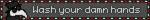
    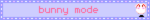
    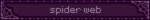
    
    
    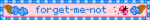
    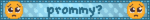
    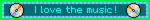
    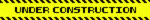
    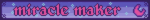
    
    
    
    
    
    
    
    
    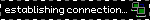
    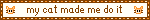
    
    
    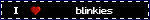

    
    

