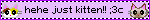
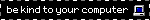

## ⌨️ console.log("hi"); 🖥️

i felt cringe writing that title

anyways hi! I'm R0CK3T_DEV, or just Jay. I'm a software and web developer professionaly, and also a game developer and a musician non-professionally. I'm 17.

## Projects

I currently don't have any highlight-worthy public projects on GitHub, but I'm working on a few as of writing this.

## Published projects

<table>
    <tr>
        <th>Project name</th>
        <th>Project banner + link</th>
    </tr>
    <tr>
        <td>AnonsAsk</td>
        <td>
            
        </td>
    </tr>
</table>

---

Here are the technologies and tools I use. Be aware that I can learn new things, and I'm always up for it!

## Programming Languages

Javascript, Typescript, HTML, CSS, PHP, C# (Unity), Lua (Roblox)

## Operating Systems

Window 10, Linux Mint

## Frameworks / libraries

React, Redux, Tailwind, Vite, Sass, Bootstrap, Express

## Dev tools

VSCode, Visual Studio 2022, Git, Github, Firebase, MySQL, NPM

## Game engines

Unity, Godot

---

## Contact

Here are my social media links (I don't act professionally on any of them, except for LinkedIn):

    
    
    
    

 

    
     
    my discord is r0ck3t_dev

---

#### unserious stuff

BLINKIE COLLECTION ATTACK GO

    
    
    
    
    
    
    
    
    
    
    
    
    
    
    
    
    
    
    
    
    
    
    
    
    
    
    
    
    
    
    
    
    
    
    
    
    

    
    

